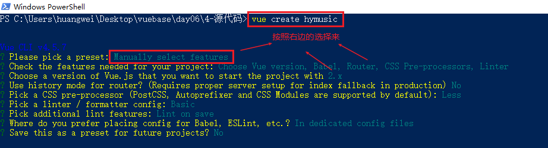

# Day06

## 黑云音乐

> 效果

http://huangjiangjun.top/hymusic

> 服务器地址

http://www.dongh5.com:9000/
http://huangjiangjun.top:9000/

> 目标

- 巩固和掌握Vue基础阶段的知识点
  1. 指令（`v-bind`、`v-for`、`v-if`、...）
  2. 样式绑定
  3. ref（音乐播放）
  4. 兄弟组件传值（音乐播放）
- axios的熟练使用
- ElementUI的初步使用

> 注意

- **因为我们的目标主要是把vue基础阶段学习的知识点应用起来，所以样式就不带大家一步一步敲了，我已经事先准备好了**
- **这个项目并没有把vue基础阶段所有的知识点都用上，因为以后我们在实际工作中也是项目中需要什么技术，就使用什么技术**
- **因为我们调用的是网易云的接口，有可能有些音乐或是MV播放不了（你懂的），那么我们就换一个去试**
- **由于教室网速比较慢，可能播放音乐或是MV的时候，没有那么快，大家点击之后，耐心等一下**

> 功能模块

- 发现音乐
- 推荐歌单
- 最新音乐
- 最新MV
- 歌单详情
- MV详情 & MV播放
- 音乐播放

> 项目搭建

1. 打开终端，切换到非中文目录下**（最好就是桌面）**，执行`vue create hymusic`

2. 选择`Manually select features`

3. 按住键盘的`上下键`进行切换，按住`空格`进行选择，选择所需要的内容，选择上`Choose Vue version`、`Babel`、`Router`、`CSS Pre-processors`、`Linter / Formatter`，最后`按回车`进入下一步

4. 版本选择`2.x`、路由模式选择hash模式`n`、预处理语言选择`Less`、ESLint相关都选择第一个、项目配置选择`In dedicated config files`代表配置都写入到单独的配置文件中，不写在`package.json`中、是否保留刚刚上面的所有选择以供下一次使用`n`

   

5. 接下来就会生成项目，安装依赖包**（这一步要保证网速流畅，否则容易安装包失败）**

6. 最后，等项目都生成好了，并且包也安装没有问题了，执行`cd hymusic`、`npm run serve`查看效果

7. 查看刚刚生成的项目结构和代码，对比下和之前不一样的地方

> 项目页面创建 & 路由规则配置 & 全局样式

1. 在`src/views`目录下创建`Discovery.vue`（发现音乐）、`Playlists.vue`(推荐歌单)、`Songs.vue`（最新音乐）、`MVs.vue`(最新MV)、`Playlist`（歌单详情）、`MV.vue`（MV详情）、`NotFound.vue`等页面

2. 在`src/components`目录下创建一个`MyAudio`子组件，将来用于播放音乐

3. 在`src/router/index.js`中配置好项目所需的路由规则，代码如下

   ```js
   import Vue from 'vue'
   import VueRouter from 'vue-router'
   Vue.use(VueRouter)
   
   // 导入子组件
   import Discovery from '../views/Discovery'
   import Playlists from '../views/Playlists'
   import Playlist from '../views/Playlist'
   import Songs from '../views/Songs'
   import MVs from '../views/MVs'
   import MV from '../views/MV'
   import NotFound from '@/views/NotFound'
   
   const routes = [
     {
       path: '/discovery',
       name: 'Discovery',
       component: Discovery
     },
     {
       path: '/',
       redirect: '/discovery'
     },
     {
       path: '/playlists',
       name: 'Playlists',
       component: Playlists
     },
     {
       path: '/playlist',
       name: 'Playlist',
       component: Playlist
     },
     {
       path: '/songs',
       name: 'Songs',
       component: Songs
     },
     {
       path: '/mvs',
       name: 'MVs',
       component: MVs
     },
     {
       path: '/mv/:id',
       name: 'MV',
       component: MV
     },
     {
       path: '*',
       component: NotFound
     }
   ]
   
   const router = new VueRouter({
     routes
   })
   
   export default router
   ```
   
4. 在`src/assets`目录下创建一个`style`文件夹，里面创建一个`global.less`全局样式文件，写好内容，并且最终在`main.js`中引入

   ```js
   import Vue from 'vue'
   import App from './App.vue'
   import router from './router'
   
   Vue.config.productionTip = false
   
   // 引入全局样式
   import '@/assets/style/global.less'
   
   new Vue({
       router,
       render: h => h(App)
   }).$mount('#app')
   ```


> App.vue

`App.vue`是我们根组件，里面包含三部分

- **左边菜单栏（使用`<router-link to="/xxx"></router-link>`进行声明式导航）**
- **右边内容显示区域（使用`<router-view></router-view>`进行路由出口配置）**
- **底部是音乐播放器子组件**

代码实现：

```vue
<template>
  <div class="index-container">
    <div class="nav">
      <ul>
        <li>
          <router-link to="/discovery">
            <span class="iconfont icon-find-music"></span>
            发现音乐
          </router-link>
        </li>
        <li>
          <router-link to="/playlists">
            <span class="iconfont icon-music-list"></span>
            推荐歌单
          </router-link>
        </li>
        <li>
          <router-link to="/songs">
            <span class="iconfont icon-music"></span>
            最新音乐
          </router-link>
        </li>
        <li>
          <router-link to="/mvs">
            <span class="iconfont icon-mv"></span>
            最新MV
          </router-link>
        </li>
      </ul>
    </div>
    <div class="main">
      <router-view></router-view>
    </div>
    <my-audio></my-audio>
  </div>
</template>

<script>
import MyAudio from '@/components/MyAudio'
export default {
  components: {
    MyAudio
  }
}
</script>

<style lang="less" scoped>
.index-container {
  height: 100%;
  display: flex;
  .nav {
    background-color: #ededed;
    width: 200px;
    height: 100%;
    li {
      height: 60px;
      cursor: pointer;
      display: flex;
      align-items: center;
      &:hover {
        background-color: #e7e7e7;
      }
      .iconfont {
        margin-right: 10px;
        font-size: 20px;
      }
      a {
        color: black;
        padding-left: 30px;
        font-size: 18px;
        line-height: 60px;
        width: 100%;
        height: 100%;
        &.router-link-active {
          color: #dd6d60;
          .iconfont {
            color: #dd6d60;
          }
        }
      }
    }
  }
  .main {
    flex: 1;
    overflow-y: scroll;
    padding: 10px 20px;
    > div {
      max-width: 1100px;
      margin: 0 auto;
    }
  }
}
</style>
```
注意：**关于在`App.vue`中用到的字体图标，这里面提供了一个在线的字体图标地址：http://at.alicdn.com/t/font_1654044_7fb6pz0mo1.css，只需要在`public/index.html`中引入即可**

```html
<!DOCTYPE html>
<html lang="en">
  <head>
    <meta charset="utf-8" />
    <meta http-equiv="X-UA-Compatible" content="IE=edge" />
    <meta name="viewport" content="width=device-width,initial-scale=1.0" />
    <link rel="icon" href="<%= BASE_URL %>favicon.ico" />
    <!-- 导入 iconfont的字体图标 -->
    <link
      rel="stylesheet"
      href="//at.alicdn.com/t/font_1654044_7fb6pz0mo1.css"
    />
    <title><%= htmlWebpackPlugin.options.title %></title>
  </head>
  <body>
    <noscript>
      <strong
        >We're sorry but <%= htmlWebpackPlugin.options.title %> doesn't work
        properly without JavaScript enabled. Please enable it to
        continue.</strong
      >
    </noscript>
    <div id="app"></div>
    <!-- built files will be auto injected -->
  </body>
</html>
```
> 网络请求封装

项目中发送网络请求使用的是`axios`，但是我们需要对它做一些封装，不然在每个页面中都要导入和设置基准路径很麻烦，安装完`axios`之后，可以统一在`main.js`中，进行设置，以后每个页面中就可以通过`this.$http`获取到`axios`实例，调用对应的方法(`GET`、`POST`、`PUT`、`DELETE`)，发送请求了

```js
import Vue from 'vue'
import App from './App.vue'
import router from './router'

Vue.config.productionTip = false

// 引入全局样式
import '@/assets/style/global.less'

// axios配置
import axios from 'axios'
// 设置基准路径
axios.defaults.baseURL = 'http://huangjiangjun.top:9000/'
// 绑定到Vue的原型上，以后每个.vue文件中，都可以通过this.$http访问到axios实例了
Vue.prototype.$http = axios

new Vue({
  router,
  render: h => h(App)
}).$mount('#app')
```
测试：为了验证刚刚的配置是否好使，我们可以在`Discovery.vue`的生命周期钩子`mounted`中发送请求试验一下

```vue
<template>
  <div>
    发现音乐
  </div>
</template>

<script>
export default {
  mounted () {
    this.getBannerList()
  },
  methods: {
    async getBannerList () {
      const res = await this.$http.get('banner')
      console.log(res.data)
    }
  }
}
</script>
```
> 发现音乐

发现音乐页面包含以下四部分：

- **轮播图(使用ElementUI实现)**
- 推荐歌单
- 最新音乐
- 推荐MV

在项目中集成`ElementUI`：https://element.eleme.cn/#/zh-CN/component/quickstart

1. 安装element-ui `npm i element-ui -S`

2. 在`main.js`中集成
	
 ```js
	import Vue from 'vue';
	import ElementUI from 'element-ui';
	import 'element-ui/lib/theme-chalk/index.css';
	import App from './App.vue';
	
	Vue.use(ElementUI);
	
	new Vue({
	    el: '#app',
	    render: h => h(App)
	})
 ```

3. 集成OK之后，后面在`vue`的页面和组件中就可以直接使用了

实现步骤：

1. 在`Discovery.vue`生命周期钩子`mounted`中发送请求，获取`轮播图`、`推荐歌单`、`最新音乐`、`最新MV`等模块所需要的数据，并且数据请求回来之后赋值给模型数据，**可以通过安装的`vue-devtools`查看模型数据是否有值**

   ```vue
   <template>
     <div>
       发现音乐
     </div>
   </template>
   
   <script>
   export default {
     data () {
       return {
         // 轮播图
         bannerList: [],
         // 推荐歌单
         recommendList: [],
         // 最新音乐
         songList: [],
         // 推荐MV
         mvList: []
       }
     },
     mounted () {
       // 获取轮播图数据
       this.getBannerList()
       // 获取推荐歌单数据
       this.getRecommendList()
       // 获取最新音乐数据
       this.getSongList()
       // 获取推荐MV数据
       this.getMvList()
     },
     methods: {
       async getBannerList () {
         const res = await this.$http.get('banner')
   
         this.bannerList = res.data.banners
       },
       async getRecommendList () {
         const res = await this.$http.get('personalized?limit=10')
   
         this.recommendList = res.data.result
       },
       async getSongList () {
         const res = await this.$http.get('personalized/newsong')
   
         this.songList = res.data.result
       },
       async getMvList () {
         const res = await this.$http.get('personalized/mv')
   
         this.mvList = res.data.result
       }
     }
   }
   </script>
   ```

2. 渲染轮播图

   ```vue
   <!-- 轮播图 -->
   <el-carousel class :interval="4000" type="card">
       <el-carousel-item v-for="(item, index) in bannerList" :key="index">
           
       </el-carousel-item>
   </el-carousel>
   ```

3. 渲染推荐歌单

   ```vue
   <!-- 推荐歌单 -->
   <div class="recommend">
       <h3 class="title">推荐歌单</h3>
       <div class="items">
           <div class="item" v-for="item in recommendList" :key="item.id">
               <div class="img-wrap" @click="toPlayList(item.id)">
                   <div class="desc-wrap">
                       <span class="desc">{{ item.copywriter }}</span>
                   </div>
                   
                   <span class="iconfont icon-play"></span>
               </div>
               <p class="name">{{ item.name }}</p>
           </div>
       </div>
   </div>
   ```

4. 渲染最新音乐

   ```vue
   <!-- 最新音乐 -->
   <div class="news">
       <h3 class="title">最新音乐</h3>
       <div class="items">
           <div class="item" v-for="(item, index) in songList" :key="index">
               <div class="img-wrap">
                   
                   <span @click="playMusic(item.id)" class="iconfont icon-play"></span>
               </div>
               <div class="song-wrap">
                   <div class="song-name">{{ item.name }}</div>
                   <div class="singer">{{ item.song.artists[0].name }}</div>
               </div>
           </div>
       </div>
   </div>
   ```

5. 渲染推荐MV

   ```vue
   <!-- 推荐MV -->
   <div class="mvs">
       <h3 class="title">推荐MV</h3>
       <div class="items">
           <div class="item" v-for="item in mvList" :key="item.id">
               <div class="img-wrap" @click="toMv(item.id)">
                   
                   <span class="iconfont icon-play"></span>
                   <div class="num-wrap">
                       <div class="iconfont icon-play"></div>
                       <div class="num">{{ item.playCount }}</div>
                   </div>
               </div>
               <div class="info-wrap">
                   <div class="name">{{ item.copywriter }}</div>
                   <div class="singer">{{ item.artistName }}</div>
               </div>
           </div>
       </div>
   </div>
   ```

> 推荐歌单

实现步骤：

1. 发送请求，获取精品歌单和歌单列表数据
2. 渲染精品歌单和歌单列表
3. 使用`watch`监听`cat`的改变，当`cat`改变之后重新发请求获取数据，然后再渲染视图
4. 点击歌单列表中的某一项，跳转到歌单详情页面

代码实现：`Playlists.vue`

```vue
<template>
  <div class="playlists-container">
    <!-- 顶部内容 -->
    <div class="top-card">
      <div class="icon-wrap">
        
      </div>
      <div class="content-wrap">
        <div class="tag">精品歌单</div>
        <div class="title">{{ topName }}</div>
        <div class="info">{{ topDesc }}</div>
      </div>
      
      <div class="bg-mask"></div>
    </div>
    <!-- 内容部分 -->
    <div class="tab-container">
      <!-- tab栏 顶部 -->
      <div class="tab-bar">
        <span
          class="item"
          :class="{ active: cat == '全部' }"
          @click="cat = '全部'"
          >全部</span
        >
        <span
          class="item"
          :class="{ active: cat == '欧美' }"
          @click="cat = '欧美'"
          >欧美</span
        >
        <span
          class="item"
          :class="{ active: cat == '华语' }"
          @click="cat = '华语'"
          >华语</span
        >
        <span
          class="item"
          :class="{ active: cat == '流行' }"
          @click="cat = '流行'"
          >流行</span
        >
        <span
          class="item"
          :class="{ active: cat == '说唱' }"
          @click="cat = '说唱'"
          >说唱</span
        >
        <span
          class="item"
          :class="{ active: cat == '摇滚' }"
          @click="cat = '摇滚'"
          >摇滚</span
        >
        <span
          class="item"
          :class="{ active: cat == '民谣' }"
          @click="cat = '民谣'"
          >民谣</span
        >
        <span
          class="item"
          :class="{ active: cat == '电子' }"
          @click="cat = '电子'"
          >电子</span
        >
        <span
          class="item"
          :class="{ active: cat == '轻音乐' }"
          @click="cat = '轻音乐'"
          >轻音乐</span
        >
        <span
          class="item"
          :class="{ active: cat == '影视原声' }"
          @click="cat = '影视原声'"
          >影视原声</span
        >
        <span
          class="item"
          :class="{ active: cat == 'ACG' }"
          @click="cat = 'ACG'"
          >ACG</span
        >
        <span
          class="item"
          :class="{ active: cat == '怀旧' }"
          @click="cat = '怀旧'"
          >怀旧</span
        >
        <span
          class="item"
          :class="{ active: cat == '治愈' }"
          @click="cat = '治愈'"
          >治愈</span
        >
        <span
          class="item"
          :class="{ active: cat == '旅行' }"
          @click="cat = '旅行'"
          >旅行</span
        >
      </div>
      <!-- tab的内容区域 -->
      <div class="tab-content">
        <div class="items">
          <div
            class="item"
            v-for="(item, index) in topPlayLists"
            :key="index"
            @click="toPlayList(item.id)"
          >
            <div class="img-wrap">
              <div class="num-wrap">
                播放量:
                <span class="num">{{ item.playCount | formatCount }}</span>
              </div>
              
              <span class="iconfont icon-play"></span>
            </div>
            <p class="name">{{ item.description }}</p>
          </div>
        </div>
      </div>
    </div>
  </div>
</template>

<script>
export default {
  data () {
    return {
      // 顶部的标题
      topName: '',
      // 顶部的描述
      topDesc: '',
      // 顶部的封面
      topCover: '',
      // 选中的分类
      cat: '全部',
      // 歌单分类
      cats: [
        '全部',
        '欧美',
        '华语',
        '流行',
        '说唱',
        '摇滚',
        '民谣',
        '电子',
        '轻音乐',
        '影视原声',
        'ACG',
        '怀旧',
        '治愈',
        '旅行'
      ],
      // 精品歌单列表
      topPlayLists: []
    }
  },
  mounted () {
    // 获取封面图数据
    this.getHighqualityData()
    // 获取歌单列表数据
    this.getTopPlayListsData()
  },
  watch: {
    cat () {
      this.getTopPlayListsData()
    }
  },
  methods: {
    async getHighqualityData () {
      const res = await this.$http.get('top/playlist/highquality?limit=1')

      this.topName = res.playlists[0].name
      this.topDesc = res.playlists[0].description
      this.topCover = res.playlists[0].coverImgUrl
    },
    async getTopPlayListsData () {
      const res = await this.$http.get(
        `top/playlist?limit=10&offset=0&cat=${this.cat}`
      )

      this.topPlayLists = res.playlists
    },
    toPlayList (id) {
      this.$router.push(`/playlist?id=${id}`)
    }
  }
}
</script>

<style lang="less" scoped>
.playlists-container {
  .top-card {
    padding: 20px;
    height: 200px;
    display: flex;
    position: relative;
    overflow: hidden;
    border-radius: 5px;
    .icon-wrap {
      margin-right: 20px;
      z-index: 1;
      img {
        width: 160px;
        height: 160px;
      }
    }
    .content-wrap {
      z-index: 1;
      .tag {
        color: #dfac67;
        border: 1px solid #dfac67;
        width: 100px;
        height: 30px;
        text-align: center;
        border-radius: 5px;
        font-size: 16px;
        line-height: 30px;
        cursor: pointer;
      }
      .title {
        color: white;
        padding-top: 10px;
      }
      .info {
        color: #888482;
        font-size: 14px;
        padding-top: 5px;
        overflow: hidden;
        text-overflow: ellipsis;
        display: -webkit-box;
        -webkit-box-orient: vertical;
        -webkit-line-clamp: 5;
      }
    }
    .bg {
      width: 100%;
      position: absolute;
      left: 0;
      top: 0;
      right: 0;
      bottom: 0;
      z-index: 0;
      filter: blur(20px);
    }
    .bg-mask {
      width: 100%;
      position: absolute;
      left: 0;
      top: 0;
      right: 0;
      bottom: 0;
      background-color: rgba(0, 0, 0, 0.5);
    }
  }
  .tab-container {
    padding-top: 30px;
    .tab-bar {
      display: flex;
      justify-content: flex-end;
      .item {
        font-size: 15px;
        color: gray;
        margin-right: 20px;
        cursor: pointer;
        &.active {
          color: #dd6d60;
        }
      }
    }
    .tab-content {
      margin-top: 20px;
      .items {
        display: flex;
        flex-wrap: wrap;
        .item {
          width: 200px;
          margin: 10px;
          position: relative;
          overflow: hidden;
          cursor: pointer;
          img {
            width: 200px;
            height: 200px;
            border-radius: 5px;
          }
          .num-wrap {
            position: absolute;
            top: 0;
            left: 0;
            font-size: 14px;
            color: white;
            line-height: 30px;
            background: rgba(0, 0, 0, 0.5);
            height: 30px;
            width: 100%;
            padding-left: 5px;
            top: -30px;
            overflow: hidden;
          }
          &:hover .num-wrap {
            top: 0;
          }
          .img-wrap {
            position: relative;
            .icon-play {
              position: absolute;
              right: 10px;
              bottom: 13px;
              width: 40px;
              height: 40px;
              color: #dd6d60;
              font-size: 20px;
              border-radius: 50%;
              display: flex;
              align-items: center;
              justify-content: center;
              background: rgba(255, 255, 255, 0.8);
              opacity: 0;
              &::before {
                transform: translateX(3px);
              }
            }
            &:hover .icon-play {
              opacity: 1;
            }
          }
          .name {
            overflow: hidden;
            text-overflow: ellipsis;
            display: -webkit-box;
            -webkit-box-orient: vertical;
            -webkit-line-clamp: 2;
            font-size: 14px;
          }
        }
      }
    }
  }
}
</style>
```

> 歌单详情

实现步骤：

1. 根据歌单id，获取歌单详情数据
2. 渲染歌单详情和歌单下的歌曲列表

代码实现：`Playlist.vue`

```vue
<template>
  <div class="playlist-container">
    <div class="top-wrap">
      <div class="img-wrap">
        
      </div>
      <div class="info-wrap">
        <p class="title">{{ title }}</p>
        <div class="author-wrap">
          
          <span class="name">{{ nickname }}</span>
          <span class="time"
            >{{ createTime | formatTime('YYYY-MM-DD') }} 创建</span
          >
        </div>
        <div class="tag-wrap">
          <span class="title">标签:</span>
          <ul>
            <li v-for="item in tags" :key="item">{{ item }}</li>
          </ul>
        </div>
        <div class="desc-wrap">
          <span class="title">简介:</span>
          <span class="desc">{{ description }}</span>
        </div>
      </div>
    </div>
    <div class="content-wrap">
      <table class="el-table playlit-table">
        <thead>
          <tr>
            <th></th>
            <th></th>
            <th>音乐标题</th>
            <th>歌手</th>
            <th>专辑</th>
            <th>时长</th>
          </tr>
        </thead>
        <tbody>
          <tr v-for="(item, index) in songList" :key="item.id">
            <td>{{ index + 1 }}</td>
            <td>
              <div class="img-wrap" @click="playMusic(item.id)">
                
                <span class="iconfont icon-play"></span>
              </div>
            </td>
            <td>
              <div class="song-wrap">
                <div class="name-wrap">
                  <span>{{ item.name }}</span>
                  <!-- mv图标 -->
                  <span
                    v-if="item.mv != 0"
                    @click="toMV(item.mv)"
                    class="iconfont icon-mv"
                  ></span>
                </div>
                <span>{{ item.subTitle }}</span>
              </div>
            </td>
            <td>{{ item.ar[0].name }}</td>
            <td>{{ item.al.name }}</td>
            <td>{{ item.dt | formatDuration }}</td>
          </tr>
        </tbody>
      </table>
    </div>
  </div>
</template>

<script>
import bus from '@/common/bus'
export default {
  data () {
    return {
      // 标题
      title: '',
      // 头像
      avatarUrl: '',
      // 封面图
      coverImgUrl: '',
      // 简介
      description: '',
      // 昵称
      nickname: '',
      // 标签
      tags: [],
      // 创建时间
      createTime: '',
      // 歌曲列表
      songList: []
    }
  },
  mounted () {
    this.getPlaylistData()
  },
  methods: {
    async getPlaylistData () {
      const res = await this.$http.get(
        `playlist/detail?id=${this.$route.query.id}`
      )

      this.songList = res.playlist.tracks
      this.title = res.playlist.name
      this.avatarUrl = res.playlist.creator.avatarUrl
      this.coverImgUrl = res.playlist.coverImgUrl
      this.nickname = res.playlist.creator.nickname
      this.tags = res.playlist.tags
      this.createTime = res.playlist.createTime
      this.description = res.playlist.description
    },
    // 播放音乐
    playMusic (id) {
      bus.$emit('playMusic', id)
    },
    // 跳转mv
    toMV (id) {
      this.$router.push(`/mv/${id}`)
    }
  }
}
</script>

<style lang="less">
.playlist-container {
  margin: auto;
  padding-top: 40px;
  .top-wrap {
    display: flex;
    color: gray;
    span {
      font-size: 17px;
    }
    .img-wrap {
      margin-right: 30px;
      img {
        width: 230px;
        height: 230px;
      }
    }
    .info-wrap {
      .title {
        margin-bottom: 20px;
      }
      .author-wrap {
        display: flex;
        align-items: center;
        margin-bottom: 25px;
        img {
          width: 35px;
          height: 35px;
          border-radius: 50%;
          margin-right: 10px;
        }
        .name {
          margin-right: 10px;
        }
        .time {
          font-size: 14px;
        }
      }
      .play-wrap {
        width: 120px;
        height: 35px;
        border-radius: 4px;
        background: linear-gradient(to right, #e85e4d, #c6483c);
        display: flex;
        align-items: center;
        justify-content: center;
        margin-bottom: 25px;
        span {
          color: white;
          &.iconfont {
            margin-right: 8px;
          }
          &.text {
            font-size: 16px;
          }
        }
      }
      .tag-wrap {
        display: flex;
        margin-bottom: 15px;
        span {
          margin: 0;
        }
        ul {
          display: flex;
          align-items: center;
        }
        li {
          font-size: 15px;
          &:not(:last-child)::after {
            content: '/';
            margin: 0 4px;
          }
        }
      }
      .desc-wrap {
        span {
          &:last-child {
            font-size: 15px;
          }
        }
      }
      span:first-child {
        margin-right: 10px;
      }
    }
  }
  .content-wrap {
    margin-top: 10px;
    border-top: 1px solid #f0f0f0;
  }
}
</style>
```

> 最新音乐

实现步骤：

1. 发送请求，获取最新音乐列表数据
2. 渲染最新音乐列表
3. 使用`watch`监听`type`的变化，当`type`发生变化之后重新获取数据，再重新渲染最新音乐列表

代码实现：`Songs.vue`

```vue
<template>
  <div class="songs-container">
    <div class="tab-bar">
      <span class="item" :class="{ active: type == 0 }" @click="type = 0"
        >全部</span
      >
      <span class="item" :class="{ active: type == 7 }" @click="type = 7"
        >华语</span
      >
      <span class="item" :class="{ active: type == 96 }" @click="type = 96"
        >欧美</span
      >
      <span class="item" :class="{ active: type == 8 }" @click="type = 8"
        >日本</span
      >
      <span class="item" :class="{ active: type == 16 }" @click="type = 16"
        >韩国</span
      >
    </div>
    <!-- 底部的table -->
    <table class="el-table playlit-table">
      <thead>
        <tr>
          <th></th>
          <th></th>
          <th>音乐标题</th>
          <th>歌手</th>
          <th>专辑</th>
          <th>时长</th>
        </tr>
      </thead>
      <tbody>
        <tr v-for="(item, index) in songList" :key="item.id">
          <td>{{ index + 1 }}</td>
          <td>
            <div class="img-wrap" @click="playMusic(item.id)">
              
              <span class="iconfont icon-play"></span>
            </div>
          </td>
          <td>
            <div class="song-wrap">
              <div class="name-wrap">
                <span>{{ item.name }}</span>
                <span
                  v-if="item.mvid != 0"
                  class="iconfont icon-mv"
                  @click="toMV(item.mvid)"
                ></span>
              </div>
              <span>{{ item.subTitle }}</span>
            </div>
          </td>
          <td>{{ item.artists[0].name }}</td>
          <td>{{ item.album.name }}</td>
          <td>{{ item.duration | formatDuration }}</td>
        </tr>
      </tbody>
    </table>
  </div>
</template>

<script>
import bus from '@/common/bus'
export default {
  data () {
    return {
      type: 0, // 类型
      songList: []
    }
  },
  mounted () {
    // 获取最新音乐数据
    this.getSongListData()
  },
  watch: {
    type () {
      this.getSongListData()
    }
  },
  methods: {
    async getSongListData () {
      const res = await this.$http.get(`top/song?type=${this.type}`)

      this.songList = res.data
    },
    // 播放音乐
    playMusic (id) {
      bus.$emit('playMusic', id)
    },
    // 去到MV详情
    toMV (id) {
      this.$router.push(`/mv/${id}`)
    }
  }
}
</script>

<style lang="less">
.songs-container {
  .tab-bar {
    display: flex;
    justify-content: flex-end;
    .item {
      font-size: 15px;
      color: gray;
      margin-right: 20px;
      cursor: pointer;
      &.active {
        color: #dd6d60;
      }
    }
  }
  .song-table {
    .song-wrap {
      > span {
        margin-top: 20px;
        display: inline-block;
        color: #bebebe;
      }
      .icon-mv {
        padding-left: 5px;
        color: #dd6d60;
      }
    }
    .img-wrap {
      position: relative;
      width: 70px;
      height: 70px;
      img {
        width: 70px;
        height: 70px;
        border-radius: 5px;
      }
      .icon-play {
        position: absolute;
        top: 50%;
        left: 50%;
        transform: translate(-50%, -50%);
        width: 25px;
        height: 25px;
        color: #dd6d60;
        font-size: 12px;
        border-radius: 50%;
        display: flex;
        align-items: center;
        justify-content: center;
        background: rgba(255, 255, 255, 0.8);
        &::before {
          transform: translateX(1px);
        }
      }
    }
  }
}
</style>
```

> 最新MV

实现步骤：

1. 发送请求，获取最新MV列表数据
2. 渲染最新MV列表
3. 使用`watch`监听`type`、`area`、`order`的变化，当`type`、`area`、`order`发生变化之后重新获取数据，再重新渲染最新MV列表
4. 点击MV列表每一项，跳转到MV详情页面

代码实现：`MVs.vue`

```vue
<template>
  <div class="mvs-container">
    <!-- 筛选条件区域 -->
    <div class="filter-wrap">
      <div class="seciton-wrap">
        <span class="section-type">地区:</span>
        <ul class="tabs-wrap">
          <li class="tab">
            <span
              class="title"
              :class="{ active: area == '全部' }"
              @click="area = '全部'"
              >全部</span
            >
          </li>
          <li class="tab">
            <span
              class="title"
              :class="{ active: area == '内地' }"
              @click="area = '内地'"
              >内地</span
            >
          </li>
          <li class="tab">
            <span
              class="title"
              :class="{ active: area == '港台' }"
              @click="area = '港台'"
              >港台</span
            >
          </li>
          <li class="tab">
            <span
              class="title"
              :class="{ active: area == '欧美' }"
              @click="area = '欧美'"
              >欧美</span
            >
          </li>
          <li class="tab">
            <span
              class="title"
              :class="{ active: area == '日本' }"
              @click="area = '日本'"
              >日本</span
            >
          </li>
          <li class="tab">
            <span
              class="title"
              :class="{ active: area == '韩国' }"
              @click="area = '韩国'"
              >韩国</span
            >
          </li>
        </ul>
      </div>
      <div class="type-wrap">
        <span class="type-type">类型:</span>
        <ul class="tabs-wrap">
          <li class="tab">
            <span
              class="title"
              :class="{ active: type == '全部' }"
              @click="type = '全部'"
              >全部</span
            >
          </li>
          <li class="tab">
            <span
              class="title"
              :class="{ active: type == '官方版' }"
              @click="type = '官方版'"
              >官方版</span
            >
          </li>
          <li class="tab">
            <span
              class="title"
              :class="{ active: type == '原声' }"
              @click="type = '原声'"
              >原声</span
            >
          </li>
          <li class="tab">
            <span
              class="title"
              :class="{ active: type == '现场版' }"
              @click="type = '现场版'"
              >现场版</span
            >
          </li>
          <li class="tab">
            <span
              class="title"
              :class="{ active: type == '网易出品' }"
              @click="type = '网易出品'"
              >网易出品</span
            >
          </li>
        </ul>
      </div>
      <div class="order-wrap">
        <span class="order-type">排序:</span>
        <ul class="tabs-wrap">
          <li class="tab">
            <span
              class="title"
              :class="{ active: order == '上升最快' }"
              @click="order = '上升最快'"
              >上升最快</span
            >
          </li>
          <li class="tab">
            <span
              class="title"
              :class="{ active: order == '最热' }"
              @click="order = '最热'"
              >最热</span
            >
          </li>
          <li class="tab">
            <span
              class="title"
              :class="{ active: order == '最新' }"
              @click="order = '最新'"
              >最新</span
            >
          </li>
        </ul>
      </div>
    </div>
    <!-- mv容器 -->
    <div class="mvs">
      <div class="items">
        <div v-for="item in mvList" :key="item.id" class="item">
          <router-link :to="'/mv/' + item.id">
            <div class="img-wrap">
              
              <div class="num-wrap">
                <div class="iconfont icon-play"></div>
                <div class="num">{{ item.playCount | formatCount }}</div>
              </div>
            </div>
            <div class="info-wrap">
              <div class="name">{{ item.name }}</div>
            </div>
          </router-link>
        </div>
      </div>
    </div>
  </div>
</template>

<script>
export default {
  data () {
    return {
      // 区域
      area: '全部',
      // 类型
      type: '全部',
      // 排序
      order: '上升最快',
      // mv列表
      mvList: []
    }
  },
  watch: {
    area () {
      this.getMvListData()
    },
    type () {
      this.getMvListData()
    },
    order () {
      this.getMvListData()
    }
  },
  mounted () {
    this.getMvListData()
  },
  methods: {
    async getMvListData () {
      const res = await this.$http.get('mv/all', {
        params: {
          offset: 0,
          limit: 12,
          area: this.area,
          type: this.type,
          order: this.order
        }
      })

      this.mvList = res.data
    },
    // 跳转到MV详情
    async toMv (id) {
      // 编程式导航
      this.$router.push(`/mv/${id}`)
    }
  }
}
</script>

<style lang="less">
.mvs-container {
  padding-top: 20px;
  .filter-wrap {
    > div {
      margin-bottom: 30px;
      vertical-align: baseline;
      display: flex;
      align-items: center;
      span {
        font-size: 14px;
        height: 100%;
        &.title {
          margin: 20px;
          color: gray;
          cursor: pointer;
          padding: 5px 20px;
          &.active {
            color: #dd6d60;
            background-color: #fcf6f5;
            border-radius: 20px;
          }
          &::before {
            content: '', pos;
          }
        }
      }
      ul {
        display: flex;
        li:not(:last-child) {
          border-right: 1px solid #f2f2f1;
        }
      }
    }
  }
  .mvs {
    .items {
      display: flex;
      justify-content: flex-start;
      flex-wrap: wrap;
      .item {
        width: 250px;
        cursor: pointer;
        margin-right: 25px;
        margin-bottom: 30px;
        .img-wrap {
          width: 100%;
          position: relative;
          img {
            width: 100%;
            border-radius: 5px;
          }
          .num-wrap {
            position: absolute;
            color: white;
            top: 0;
            right: 0;
            display: flex;
            align-content: center;
            font-size: 15px;
            padding-right: 5px;
            padding-top: 2px;
            .icon-play {
              font-size: 12px;
              display: flex;
              align-items: center;
              margin-right: 5px;
            }
          }
        }
        .info-wrap {
          .name {
            font-size: 15px;
          }
          .singer {
            font-size: 14px;
            color: #c5c5c5;
          }
        }
      }
    }
  }
}
</style>
```

> MV详情

实现步骤：

1. 根据mv的id，获取mv播放地址、mv详情、艺术家信息、相关推荐MV列表等数据
2. 渲染mv播放器、mv详情、艺术家信息、相关推荐MV列表
3. 当点击了相关推荐MV列表中的某一项，使用`watch`监听路由参数的改变，然后重新获取数据，重新渲染视图

代码实现：`MV.vue`

```vue
<template>
  <div class="mv-container">
    <div class="mv-wrap">
      <h3 class="title">mv详情</h3>
      <!-- mv -->
      <div class="video-wrap">
        <video controls :src="mvUrl" autoplay></video>
      </div>
      <!-- mv信息 -->
      <div class="info-wrap">
        <div class="singer-info">
          <div class="avatar-wrap">
            
          </div>
          <span class="name">{{ artistName }}</span>
        </div>
        <div class="mv-info">
          <h2 class="title">{{ mvName }}</h2>
          <span class="date">发布：{{ publishTime }}</span>
          <span class="number">播放：{{ playCount | formatCount }}次</span>
          <p class="desc">{{ desc }}</p>
        </div>
      </div>
    </div>
    <!-- 相关推荐 -->
    <div class="mv-recommend">
      <h3 class="title">相关推荐</h3>
      <div class="mvs">
        <div class="items" v-for="item in simiMVList" :key="item.id">
          <div class="item" @click="toMV(item.id)">
            <div class="img-wrap">
              
              <span class="iconfont icon-play"></span>
              <div class="num-wrap">
                <div class="iconfont icon-play"></div>
                <div class="num">{{ item.playCount | formatCount }}</div>
              </div>
              <span class="time">{{ item.duration | formatDuration }}</span>
            </div>
            <div class="info-wrap">
              <div class="name">{{ item.name }}</div>
              <div class="singer">{{ item.artistName }}</div>
            </div>
          </div>
        </div>
      </div>
    </div>
  </div>
</template>

<script>
import bus from '@/common/bus'
export default {
  data () {
    return {
      // mv地址
      mvUrl: '',
      // mv的名字
      mvName: '',
      // 播放次数
      playCount: '',
      // 发布时间
      publishTime: '',
      // 描述
      desc: '',
      // 歌手名
      artistName: '',
      // 封面
      artistCover: '',
      // 相关推荐MV
      simiMVList: []
    }
  },
  watch: {
    '$route.params.id' () {
      // 重新获取MV的播放地址
      this.getMVUrlData()
      // 重新获取MV的详细信息
      this.getMVInfoData()
      // 重新获取相关推荐MV
      this.getSimiMVListData()
    }
  },
  mounted () {
    // 获取MV的播放地址
    this.getMVUrlData()
    // 获取MV的详细信息
    this.getMVInfoData()
    // 获取相关推荐MV
    this.getSimiMVListData()
  },
  methods: {
    async getMVUrlData () {
      // 停止音乐播放
      bus.$emit('pauseMusic')

      const res = await this.$http.get(`mv/url?id=${this.$route.params.id}`)

      this.mvUrl = res.data.url
    },
    async getMVInfoData () {
      const res = await this.$http.get(
        `mv/detail?mvid=${this.$route.params.id}`
      )

      // 获取艺术家信息
      const res2 = await this.$http.get(`artists`, {
        params: {
          id: res.data.artistId
        }
      })

      this.mvName = res.data.name
      this.playCount = res.data.playCount
      this.publishTime = res.data.publishTime
      this.desc = res.data.desc

      // 歌手名
      this.artistName = res2.artist.name
      this.artistCover = res2.artist.picUrl
    },
    async getSimiMVListData () {
      const res = await this.$http.get(`simi/mv?mvid=${this.$route.params.id}`)

      this.simiMVList = res.mvs
    },
    // 切换MV
    toMV (id) {
      this.$router.push(`/mv/${id}`)
    }
  }
}
</script>

<style lang="less">
.mv-container {
  display: flex;
  .title {
    margin-bottom: 20px;
  }
  .mv-wrap {
    width: 700px;
    margin-right: 35px;
    .date {
      margin-right: 25px;
    }
    .date,
    .number {
      color: #bebebe;
      font-size: 14px;
    }
    .video-wrap {
      width: 100%;
      height: 390px;
      margin-bottom: 20px;
      video {
        border-radius: 5px;
        height: 100%;
        width: 100%;
        outline: none;
      }
    }
    .info-wrap {
      margin-bottom: 50px;
      .singer-info {
        display: flex;
        align-items: center;
        margin-bottom: 35px;
        .avatar-wrap {
          width: 70px;
          height: 70px;
          border-radius: 50%;
          margin-right: 10px;
          overflow: hidden;
          img {
            height: 100%;
          }
        }
      }
      .mv-info {
        .title {
          font-size: 30px;
        }
        .desc {
          font-size: 15px;
          margin-top: 20px;
        }
      }
    }
  }
  .mv-recommend {
    flex: 1;
    .mvs {
      .items {
        display: flex;
        flex-wrap: wrap;
        .item {
          cursor: pointer;
          width: 100%;
          display: flex;
          align-items: center;
          padding: 10px;
          cursor: pointer;

          &:hover {
            background-color: #f5f5f5;
          }
          .img-wrap {
            width: 180px;
            position: relative;
            margin-right: 10px;
            > .icon-play {
              position: absolute;
              top: 50%;
              left: 50%;
              transform: translate(-50%, -50%);
              width: 40px;
              height: 40px;
              color: #dd6d60;
              font-size: 20px;
              border-radius: 50%;
              display: flex;
              align-items: center;
              justify-content: center;
              background: rgba(255, 255, 255, 0.8);
              opacity: 0;
              &::before {
                transform: translateX(3px);
              }
            }
            &:hover > .icon-play {
              opacity: 1;
            }
            img {
              width: 100%;
              border-radius: 5px;
            }
            .num-wrap {
              position: absolute;
              color: white;
              top: 0;
              right: 0;
              display: flex;
              align-content: center;
              font-size: 15px;
              padding-right: 5px;
              padding-top: 2px;
              .icon-play {
                font-size: 12px;
                display: flex;
                align-items: center;
                margin-right: 5px;
              }
            }
            .time {
              position: absolute;
              bottom: 5px;
              right: 5px;
              color: white;
              font-size: 15px;
            }
          }
          .info-wrap {
            flex: 1;
            .name {
              font-size: 15px;
            }
            .singer {
              font-size: 14px;
              color: #c5c5c5;
            }
          }
        }
      }
    }
  }
}
</style>
```

> 音乐播放 & 音乐暂停

实现步骤：

1. 先在`src`目录下，创建一个`common/bus.js`，里面写好公共`bus`的代码，并且导出

   ```js
   import Vue from 'vue'
   
   const bus = new Vue()
   
   export default bus
   ```

2. 在`发现音乐`、`歌单详情`、`最新音乐`中，当点击了播放按钮之后，通过公共`bus`触发播放音乐事件，并且传递音乐id

   ```vue
   <script>
   import bus from '@/common/bus'
   export default {
       methods: {
           // 播放音乐
           playMusic (id) {
             bus.$emit('playMusic', id)
           }
       }
   }
   </script>
   ```

3. 在`MyAudio.vue`子组件的`mounted`生命周期钩子中，监听播放事件，拿到音乐id之后，发请求，获取音乐播放url，然后赋值给`MyAudio`的模型`audioURL`，最终实现音乐播放

   ```vue
   <template>
     <div class="player">
       <audio ref="audioRef" controls autoPlay :src="audioURL" loop></audio>
     </div>
   </template>
   
   <script>
   import bus from '@/common/bus'
   export default {
     data () {
       return {
         audioURL: ''
       }
     },
     mounted () {
       // 监听播放音乐事件
       bus.$on('playMusic', async id => {
         const res = await this.$http.get(`song/url?id=${id}`)
   
         this.audioURL = res.data && res.data[0].url
       })
     }
   }
   </script>
   
   <style lang="less" scoped>
   .player {
     background: #f1f3f4;
     height: 60px;
     position: fixed;
     bottom: 0;
     left: 0;
     width: 100%;
   }
   audio {
     width: 100%;
     border-radius: none;
     outline: none;
   }
   </style>
   ```

4. 在`MV.vue`的获取MV播放地址的方法中，使用公共`bus`，触发暂停音乐播放的事件

   ```vue
   <script>
   import bus from '@/common/bus'
   export default {
   	methods: {
           async getMVUrlData () {
             // 暂停音乐播放
             bus.$emit('pauseMusic')
           }
       }
   }
   </script>
   ```

5. 在`MyAudio.vue`子组件的`mounted`生命周期钩子中，监听音乐暂停事件，然后通过`ref`拿到`audio`实例，调用它的`pause`方法，最终实现音乐暂停效果

   ```vue
   <script>
   import bus from '@/common/bus'
   export default {
     mounted () {
         // 监听暂停播放音乐事件
         bus.$on('pauseMusic', () => {
             this.$refs.audioRef.pause()
         })
     } 
   }
   </script>
   ```

> 其它

页面与组件的关系：

- 页面比较大，组件比较小
- 页面需要在路由中配置，而组件不需要在路由中配置
- 组件一般是在页面中使用的，需要在页面中引入并且注册之后才能用